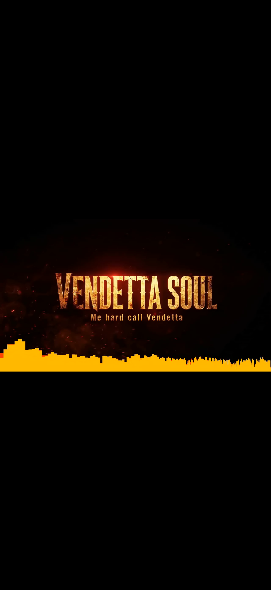

# Kash Crown: KC VENDETTA BOUNCE

The signature visualizer for every Kash Crown release. Upload a song, say
**"Use KC VENDETTA BOUNCE for this"**, and you get:

| Output | Format |
|---|---|
| `TITLE_Youtube_Bars_HD.mp4` | 16:9 1280×720, full song |
| `TITLE_TikTok_63s.mp4` | 9:16 720×1280, loudest 63 seconds |
| `TITLE_Thumbnail.png` | 16:9 still from the loudest moment |



## Where it lives

| Copy | Path | Purpose |
|---|---|---|
| **Source of truth** | `.claude/skills/kc-vendetta-bounce/` | Git backup; loads automatically in any Claude Code session on this repo |
| claude.ai / Claude app | `kash-crown/release/kc-vendetta-bounce.zip` | Upload once, then it's available in every chat |
| Claude Code, global | `~/.claude/skills/kc-vendetta-bounce/` | Installed by `install.sh` / `install.ps1` |
| Obsidian | `kash-crown/obsidian/KC Vendetta Bounce.md` | Human-readable backup note with the full renderer source |

## Install globally

**claude.ai / Claude desktop / mobile:** in Settings, go to Capabilities → Skills, choose *Upload skill*, and
select `kash-crown/release/kc-vendetta-bounce.zip`.

**Claude Code on macOS / Linux:**
```bash
git clone https://github.com/elias-hivemind/agents.git && cd agents
./kash-crown/install.sh "$HOME/Documents/Obsidian Vault"   # vault path optional
```

**Claude Code on Windows (PowerShell):**
```powershell
git clone https://github.com/elias-hivemind/agents.git; cd agents
powershell -ExecutionPolicy Bypass -File kash-crown\install.ps1 -Vault "$HOME\Documents\Obsidian Vault"
```

Both installers copy the skill to `~/.claude/skills/`, move any older install to
`~/.claude/skill-backups/`, install `numpy pillow imageio-ffmpeg`, self-test the renderer, and
(if you pass a vault) drop the note into `<Vault>/Kash Crown/Skills/`.

## Render by hand
```bash
python3 .claude/skills/kc-vendetta-bounce/scripts/render.py "Vendetta Soul.wav" \
  --title "VENDETTA SOUL" --tagline "Me hard call Vendetta" --out ./renders
```
Flags: `--only youtube|tiktok`, `--tiktok-start 1:12`, `--preview 8`, `--scale 1.5` (1080p).
Requirements: Python 3.9+, `numpy`, `pillow`, and ffmpeg (system install or `imageio-ffmpeg`).

## Changing the look
The look is locked in the constants at the top of `scripts/render.py`. After editing, rebuild
the zip and the Obsidian note, then re-run the installer:
```bash
python3 kash-crown/build.py && ./kash-crown/install.sh
```
Title font: Anton (SIL Open Font License 1.1), bundled in `assets/fonts/`.
